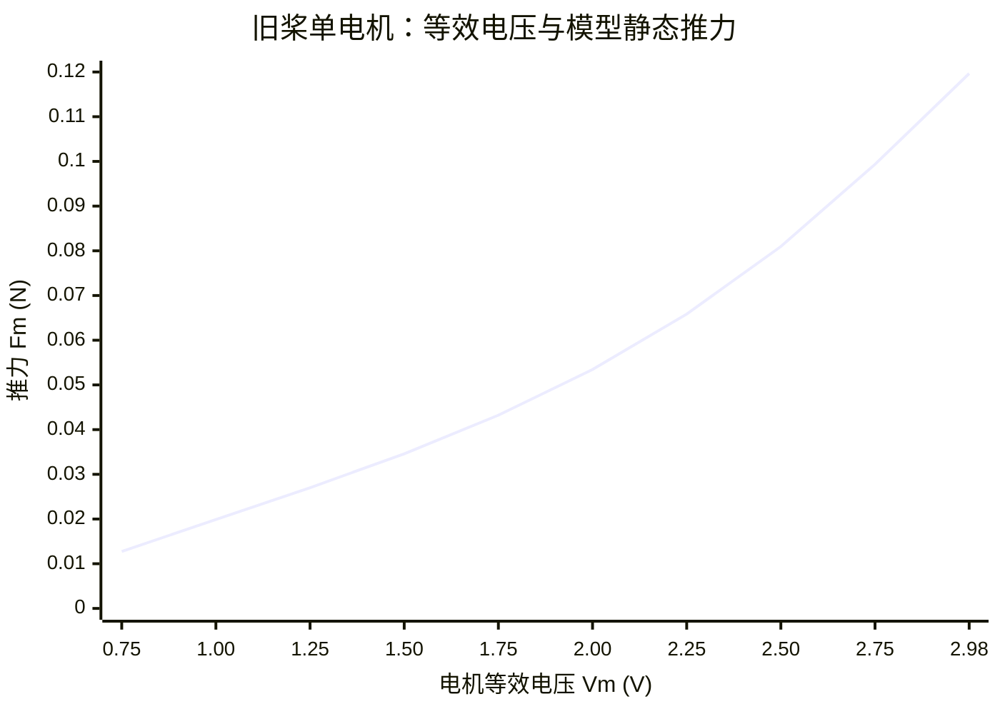

# Crazyflie 2.1 有刷电机、原装旧桨：硬件、固件与推力映射说明

> 记录日期：2026-09-30。本文针对本次已成功刷机并通过 Crazyflie Client 连接的飞机。**“已确认”**指使用者报告的配置或终端输出；**“官方标称”**指 Bitcraze 对该型号的产品资料；**“模型估计”**指固件曲线算出的数值，不等同于对这架飞机的推力实测。

## 1. 当前配置一览

| 项目 | 当前记录 | 依据与边界 |
| --- | --- | --- |
| 飞机 | 原版 **Crazyflie 2.1**，四轴、有刷电机 | 使用者确认；不是 2.1 Brushless，也不是换装 47-17 新桨的 2.1+。 |
| 螺旋桨 | 原装旧桨，固件选择 `Legacy Propellers` | 使用者确认桨型；具体每片的 A/B 标记、磨损状态尚未逐片检查。Bitcraze 将旧桨的顺/逆时针标记列为 A/A1/A2 和 B/B1/B2；47-17R/47-17 是新桨。[安装说明](https://www.bitcraze.io/documentation/tutorials/getting-started-with-crazyflie-2-x/) |
| 电机 | 四个有刷空心杯直流电机 | 与原版套件相符。官方原版套件列出 7 mm 直径电机；这架飞机的电机批次和使用时数未知。[套件清单](https://store.bitcraze.io/products/crazyflie-2-1) |
| 电源 | 机载单节锂聚合物电池 | 本次刷机和开机使用了电池；**实际容量和健康状态未读取**。原版套件配 250 mAh 电池，不能据此断定现装电池仍是原装。[套件清单](https://store.bitcraze.io/products/crazyflie-2-1) |
| 无线通信 | 电脑端 Crazyradio PA；Client 已连接，之前截图显示 `radio://0/100/2M` | 连接状态已由使用者确认。URI 是当次连接记录，后续设置可能改变。 |
| 开发环境 | Ubuntu 终端；Python 虚拟环境 `~/crazyflie-venv`；源码目录 `~/crazyflie-firmware` | 本次终端记录。虚拟环境是**电脑端工具环境**，不安装在飞机上。 |
| 主控固件 | 从本地 `crazyflie-firmware` 源码构建的 `build/cf2.bin`，经 `make cload` 刷入 STM32 | 刷写日志显示 `Flashing 1 of 1 to stm32 (fw): 307167 bytes (300 pages)`，随后 Client 连接成功。源码的精确 Git 提交、固件版本字符串尚未记录。 |
| nRF 固件 | 本次**未更新** | 日志为 `No need to flash nRF soft device`；显示当前引导程序版本 `[2024.10.0]`，这**不是 STM32 主固件版本**。 |

原版 2.1 的**官方标称**起飞重量是约 29 g，外形约 92 × 92 × 29 mm。主控为 STM32F405；nRF51822 管理无线与电源。官方产品资料列出 BMI088 惯性传感器和 BMP388 气压计；`cf2` 平台也支持不同批次的传感器组合，因此不能只凭型号断定本机传感器的实际料号。实际重量、是否装有扩展板、传感器识别结果均待现场确认。[产品规格](https://www.bitcraze.io/products/old-products/crazyflie-2-1/) · [平台说明](https://www.bitcraze.io/documentation/repository/crazyflie-firmware/master/userguides/platform/) · [系统架构](https://www.bitcraze.io/documentation/system/platform/cf2-architecture/)

## 2. 已刷入的主固件配置

本次 `build/.config` 的核对结果如下（终端实际输出）：

```text
CONFIG_PLATFORM_CF2=y
CONFIG_ENABLE_THRUST_BAT_COMPENSATED=y
CONFIG_CRAZYFLIE_LEGACY_PROPELLERS=y
# CONFIG_CRAZYFLIE_21_PLUS is not set
```

这些设置的含义分别是：选择 Crazyflie 2.x 有刷平台；启用电池电压推力补偿；加载旧桨的推力曲线；不使用 2.1+ 新桨曲线。`Legacy Propellers` 是**编译配置**，已进入本次 `cf2.bin`；以后若重新运行 `make cf2_defconfig` 或更新源码重新构建，应再次检查 `build/.config`。官方 Kconfig 的默认桨型是 `2.1+ Propellers`。[Kconfig](https://github.com/bitcraze/crazyflie-firmware/blob/master/Kconfig) · [电池补偿说明](https://www.bitcraze.io/documentation/repository/crazyflie-firmware/master/functional-areas/battery_compensation/)

主固件在 STM32 上执行飞行控制；nRF51 负责无线与电源相关功能。此次 `make cload` 的目标是 `stm32-fw`，刷写日志完成 300 页且未显示错误；飞机正常开机并连接 Client，说明主固件至少已经启动和通信。**尚无飞行或推力台实测**，因此本文不把通信成功写成飞行性能验证。[构建与刷写说明](https://www.bitcraze.io/documentation/repository/crazyflie-firmware/master/building-and-flashing/build/) · [系统架构](https://www.bitcraze.io/documentation/system/platform/cf2-architecture/)

## 3. 推力信号链和单位


这里的 `u` 是分配到**一个电机**的 16 位内部命令，范围 `0…65535`。开启本次配置的电池补偿后，固件用 `u` 表示目标推力，求出所需的电机等效电压，再按当前电池电压决定 PWM。因此 `u / 65535` **不能当作 PWM 占空比**；客户端的整体油门或控制器总推力也不能直接套用单电机公式。固件中 `motorsCompensateBatteryVoltage()` 实现了该反算。[电机驱动源码](https://github.com/bitcraze/crazyflie-firmware/blob/master/src/drivers/src/motors.c)

定义：

- `V_bat`：负载下供给电机的电池电压，单位 V；此处的 `3.7 V` 只是计算示例，并非本机已测电压。
- `p`：实际 PWM 的 16 位比例数，约在 `0…65535`；占空比 `d = p / 65535`。
- `V_m = V_bat × d`：曲线使用的电机**等效电压**，单位 V；它是 PWM 周期平均的模型量，不代表电机端始终为恒定直流电压。
- `F_m`：单电机旧桨的**静态推力模型值**，单位 N；四电机等效总推力近似为 `ΣF_m,i`。

## 4. 原装旧桨的单电机推力曲线

Bitcraze 的 `platform_defaults_cf2.h` 在 `CONFIG_CRAZYFLIE_LEGACY_PROPELLERS` 分支给出的拟合式为：

$$
\begin{aligned}
V_m &= V_{\mathrm{bat}}\frac{p}{65535},\\
F_m(V_m) &= -0.014830744918356092
 +0.04724465241828281V_m\\
&\quad -0.01847364358025878V_m^2
 +0.005960923942142V_m^3.
\end{aligned}
$$

系数分别以 N、N/V、N/V²、N/V³ 计。下面的图和表由该公式计算；图仅画出约 `0.75…2.98 V` 的**固件补偿工作区间**，不是在低于起转阈值或最大电压附近对真实硬件的可靠外推。[平台默认值源码](https://github.com/bitcraze/crazyflie-firmware/blob/master/src/platform/interface/platform_defaults_cf2.h)



| `V_m` (V) | 单电机 `F_m` (N) | 约合克力 (gf) | 若 `V_bat=3.7 V`，PWM 占空比 |
| ---: | ---: | ---: | ---: |
| 1.00 | 0.01990 | 2.03 | 27.0% |
| 1.50 | 0.03459 | 3.53 | 40.5% |
| 2.00 | 0.05345 | 5.45 | 54.1% |
| 2.25 | 0.06585 | 6.72 | 60.8% |
| 2.50 | 0.08096 | 8.26 | 67.6% |
| 2.75 | 0.09935 | 10.13 | 74.3% |
| 2.98 | 0.11965 | 12.20 | 80.5% |

换算采用 `1 gf = 0.00980665 N`。表中只是在指定电池电压下对**相同等效电压**换算 PWM；实际电池电压在负载下变化，电机、桨叶磨损及气流也会改变实测值。Bitcraze 另有较早的整机 PWM 测量资料；其设备和条件与这条当前固件旧桨拟合曲线不同，不能混成同一组标定数据。[PWM 测量记录](https://www.bitcraze.io/documentation/repository/crazyflie-firmware/master/functional-areas/pwm-to-thrust/)

### 从目标推力反算命令和 PWM

当前固件设置 `THRUST_MAX = 0.12 N/电机`，`THRUST_MIN = 0.012817578393224994 N/电机`。补偿函数先把每个电机的命令换算为目标值：

$$F_{\mathrm{target},m}=0.12\frac{u}{65535}\;\mathrm N,\qquad
u\approx65535\frac{F_{\mathrm{target},m}}{0.12\;\mathrm N}. $$

然后求解 `F_m(V_m)=F_target,m` 中工作区间的电压根，并计算 `p≈65535×V_m/V_bat`，最后受 16 位 PWM 上限及电机驱动实现约束。**目标低于 `THRUST_MIN` 时，固件补偿函数直接返回 0 PWM**，相当于 `u < 7000` 的低目标推力区；它不是把三次式的负截距当成真实的负推力。低电池电压时也可能因 PWM 饱和而达不到目标推力。以上阈值、缩放及反算见官方源码。[平台默认值](https://github.com/bitcraze/crazyflie-firmware/blob/master/src/platform/interface/platform_defaults_cf2.h) · [补偿函数](https://github.com/bitcraze/crazyflie-firmware/blob/master/src/drivers/src/motors.c)

**无载标称质量的悬停估算：**若实际起飞质量恰为官方标称 `m=0.029 kg`，水平静止悬停的总重力约 `mg=0.2844 N`；均分到四个电机为 `0.07110 N/电机`。代入上述模型，单电机命令约 `u=38829`；在**假设** `V_bat=3.7 V` 时，`V_m≈2.343 V`、`p≈41493`、PWM 占空比约 `63.3%`。这不是这架飞机实测的悬停指令；真实值依赖实际重量、控制器修正、地效、桨叶和电机状态。[标称质量](https://www.bitcraze.io/products/old-products/crazyflie-2-1/) · [推力曲线及缩放](https://github.com/bitcraze/crazyflie-firmware/blob/master/src/platform/interface/platform_defaults_cf2.h)

## 5. 本次刷机和连接的证据

1. 递归克隆 `crazyflie-firmware` 及其子模块完成。
2. `make cf2_defconfig` 成功；`make menuconfig` 在本机段错误，于是将**实际位于 `build/.config`** 的配置改为旧桨，并由 `make olddefconfig` 处理。随后读回四行配置，结果见第 2 节。
3. `make -j$(nproc)` 成功，生成约 300 KB 的 `build/cf2.bin`。
4. `make cload` 日志显示经 Crazyradio PA 将 `307167 bytes`、`300 pages` 写入 `stm32-fw`；本次不需要刷 nRF SoftDevice。
5. 飞机关机再正常启动后，蓝灯常亮、前右红灯闪烁；Client 成功连接，飞机前左侧通信灯出现快速红/绿闪烁，视觉上可能显黄。官方将后方双蓝灯常亮、前右红灯每秒约两次闪烁列为正常就绪；前左灯闪烁表示无线连接。[LED 官方说明](https://www.bitcraze.io/documentation/tutorials/getting-started-with-crazyflie-2-x/)

此前客户端截图出现 `No input-device found`，并有一次 `State Estimate Z = 64.96` 的异常读数。它们只是当时的界面观察，**未确认是否仍持续**；连接成功也不能证明位置估计可用于 `Posit` 模式。在需要飞行前，应检查输入设备和对应控制方式，并在飞机水平静止时确认姿态、位置估计是否合理；位置控制还取决于实际安装的定位扩展板或外部定位系统。当前并无扩展板清单或现场测量结果。

## 6. 如何补齐可复现记录

在使用者自己的 Ubuntu 源码目录中运行以下**只读**命令，并把结果保存在实验记录里，可确定这一次源码版本和模型常量：

```bash
cd ~/crazyflie-firmware
git rev-parse HEAD
git status --short
grep -E '^(CONFIG_PLATFORM_CF2|CONFIG_ENABLE_THRUST_BAT_COMPENSATED|CONFIG_CRAZYFLIE_LEGACY_PROPELLERS|# CONFIG_CRAZYFLIE_21_PLUS)' build/.config
grep -A8 'defined(CONFIG_CRAZYFLIE_LEGACY_PROPELLERS)' src/platform/interface/platform_defaults_cf2.h
sha256sum build/cf2.bin
```

`git rev-parse HEAD` 记录源码提交；`git status --short` 显示是否有本地修改；哈希只标识**电脑上的固件文件**，除非再从飞机读取并比较，否则不能独立证明机上字节完全相同。记录实际电池标签、电压、称重质量、桨叶 A/B 标识以及有无 Flow/Lighthouse/Loco 等扩展板后，才能把“标称配置”改写成这架飞机的完整实物清单。

## 资料

- [Bitcraze：Crazyflie 2.1 产品规格](https://www.bitcraze.io/products/old-products/crazyflie-2-1/)
- [Bitcraze：Crazyflie 2.x 入门、桨叶与 LED](https://www.bitcraze.io/documentation/tutorials/getting-started-with-crazyflie-2-x/)
- [Bitcraze：电池推力补偿说明](https://www.bitcraze.io/documentation/repository/crazyflie-firmware/master/functional-areas/battery_compensation/)
- [Bitcraze 固件：`Kconfig`](https://github.com/bitcraze/crazyflie-firmware/blob/master/Kconfig)
- [Bitcraze 固件：`platform_defaults_cf2.h`（旧桨系数和阈值）](https://github.com/bitcraze/crazyflie-firmware/blob/master/src/platform/interface/platform_defaults_cf2.h)
- [Bitcraze 固件：`motors.c`（电压补偿与 PWM 反算）](https://github.com/bitcraze/crazyflie-firmware/blob/master/src/drivers/src/motors.c)

> 在线源码链接指向 Bitcraze 的 `master`，可能随时间更新。本机精确提交尚未提供；若以后复现实验，请以刷入时本地仓库提交和源码文件为准。
